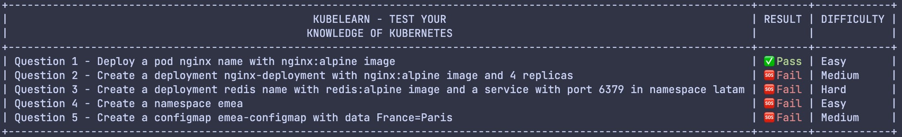

# Kubelearn - Learn how to deploy objects in kubernetes

## how to use

clone the repository

```bash
git clone git@github.com:miltlima/kubelearn.git
```

Enter inside folder kubelearn

```bash
cd kubelearn
```

Prepare environment ( this will create kubernetes objects needed for some questions)

```bash
make all 
```

For remove kubernetes objects use the following command

```bash
make clean
```

## Answer the questions below

### Questions

| Questions   | Description |
| ----------- | ----------- |
| 1 | Create a new pod called `nginx` with `nginx:alpine` image in default namespace.|
| 2 | Create a new deployment called `nginx-deployment` with `nginx:1.17` image and `4 replicas` in default namespace.|
| 3 | Create a new deployment called `redis` with image `redis:alpine` in `latam` namespace, and create a service called `redis-service` with port `6379` in same namespace.|
| 4 | Create a namespace called `emea`|
| 5 | Create a configmap `europe-configmap` with data `France=Paris`|
| 6 | Create a pod `thsoot` with label `country=china`, `amazon/amazon-ecs-network-sidecar:latest` image and namespace `asia`|
| 7 | Create a persistent volume `unicorn-pv` with capacity `1Gi` and access mode `ReadWriteMany` and host path `/tmp/data`|
| 8 | Create a persistent volume claim `unicorn-pvc` with capacity `400Mi` and access mode `ReadWriteMany`|
| 9 | Create a pod `webserver` in `public` namespace with `nginx:alpine` image and a volume mount `/usr/share/nginx/html` and a persistent volume claim `unicorn-pvc`|
| 10| There is a pod with problem, Can you able to solve it ?|
| 11| Create a network policy `allow-policy-colors` to allow `redmobile-webserver` to access `bluemobile-dbcache` (There objects are created in colors namespace)|

### Running the following command

```bash
go run main.go
```

### This will show the table above


